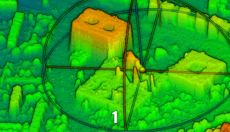
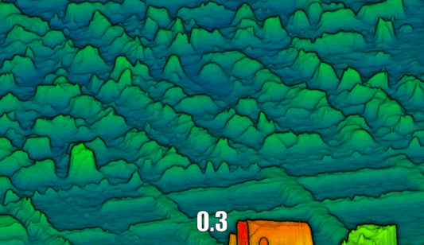
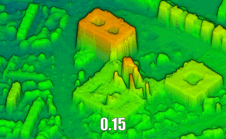
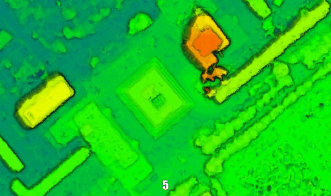

.. _denoise_point_cloud:

===================
Denoise point cloud
===================

Denoising a point cloud consists in retrieving the genuine surface given by the sparse representation.
Points are moved accordingly in order to fit a surface model.

Bilateral filtering
===================

    | *Action* : "denoise_pcd"
    | *Method* : "bilateral"

Bilateral filtering is the most common way of achieving point cloud denoising.
It is an iterative process where points are moved along their local normal (which represents the
local surface direction) which is computed with the information available
(color, neighbours, etc.). The distance along the normal is computed as the mean distance to its
N nearest neighbours and its normal orientation according to the one of its neighbours.

It is supposed to respect the gradients in the point cloud while denoising flat surfaces.

The mathematical operation can be described as following:

.. math::

    p' = p + w \cdot \mathbf{n}_p

.. math::

    with \ \ & p' \ \text{the new position of point } p \\
             & \mathbf{n}_p \ \text{the normal vector to point } p \\
             & w = \frac{\sum_{v \in \mathcal{N}(v)}w_{d}(|| v-p ||) \cdot w_n(| \langle \mathbf{n}_p, v - p \rangle  |) \cdot \langle \mathbf{n}_p, v - p \rangle }{\sum_{v \in \mathcal{N}(v)}w_{d}(|| v-p ||) w_n(| \langle \mathbf{n}_p, v - p \rangle  |)}

At each iteration, the vertex's neighbours :math:`\mathcal{N}(p)` are computed and the vertex's
position :math:`p` is moved of the quantity :math:`w \cdot \mathbf{n}_p` .
As this approach is simple, it can be adapted to take as many parameters as desired. For example,
one could use a semantic information to apply different parameters for each class of object.

The weight :math:`w` is computed according to a normal distribution:

.. math::

    w(x) = \exp{\left( \frac{- x^2}{2\sigma^2} \right)}

This implementation was written from scratch inspired by the following paper: Digne, J., & Franchis, C.D. (2017). The Bilateral Filter for Point Clouds. Image Process. Line, 7, 278-287.
One important difference is that in the paper, the normal comparison is done with points sharing an edge with the vertex.
In our case, we can hardly determine which points share edges with others because of the high noise level. So, we make this computation on
all the nearest neighbours.

Preliminary Qualitative Parametric study
----------------------------------------

Denoising is one of the key steps in the reconstruction process.
Thus, a preliminary parametric study has been conducted to get heuristics on the parameters
available to guide the future user.
Four parameters were investigated: the number of iterations, the :math:`\sigma` over the distance,
the :math:`\sigma` over the normals' orientation and the number of neighbours.
It was conducted on a subset of Nanterre PHR data with outliers removed.
Except the studied parameter, the rest of the configuration is fixed to the following values:
:math:`N_{iterations}=10, \sigma_d=1.5, \sigma_n=1., N_{neighbours}=20`.

* **Number of iterations**:
    We tested five values: 1, 5, 10, 20, 50. The results show that there is a stable value for the number of iterations
    that ensures that surfaces are smoothed, but that the process does not emphasize the noise. Indeed, if it is too
    low, noise is still quite important. However, if it is too high, the noise tends to be amplified and structured
    in faces. In our tests on Nanterre, 10 was a good compromise.

|

* :math:`\mathbf{\sigma}` **over the distance**:
    We tested five values: 0.3, 0.5, 1.0, 1.5, 5.0. The higher, the smoother. Warning: buildings like individual houses
    that do not have sharp edges tend to be uniformly smoothed.

|

* :math:`\mathbf{\sigma}` **over the normals' orientation**:
    We tested four values: 0.15, 0.3, 1.0, 1.5. The impact is small on the result.

|

* **Number of neighbours**:
    We tested five values: 5, 20, 50, 100. The more neighbours is taken into account, the more surfaces are uniformly smoothed.

|

A general remark over the denoising task: the lesser the shape of the object is sharp (straight walls, roof sides defined, etc.), the more it will be uniformly smoothed by the bilateral filter.
Thus, if high buildings with flat roofs tend to be well redefined, individual houses or buildings with specific roofs tend to be globally smoothed.

