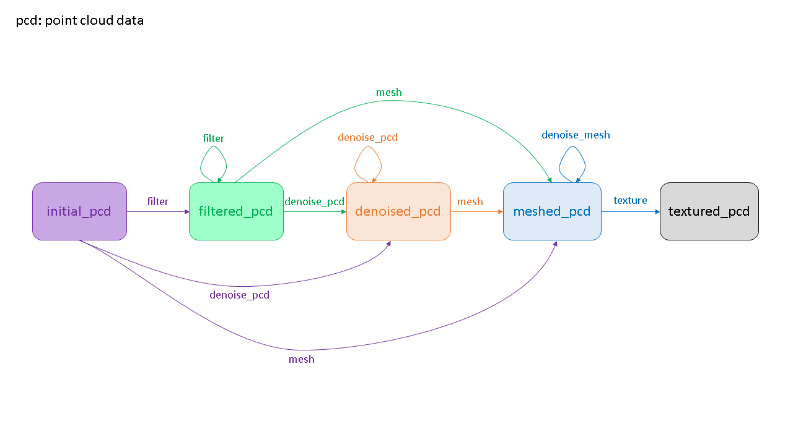

<div align="center">
  <a href="https://gitlab.cnes.fr/cars/mesh_3d"></a>

<h4>Mesh 3D</h4>

[](https://www.python.org/downloads/release/python-360/)

[](CONTRIBUTING.md)

<p>
  <a href="#overview">Overview</a> •
  <a href="#requirements">Requirements</a> •
  <a href="#features">Features</a> •
  <a href="#quick-start">Quick Start</a> •
  <a href="#documentation">Documentation</a> •
  <a href="#contribution">Contribution</a> •
  <a href="#references">References</a>
</p>
</div>

## Overview

Mesh 3D short description:

"3D Surface reconstruction with texture and classification from remote sensing photogrammetric point cloud"


* Free software: Apache Software License 2.0
* Documentation: https://mesh-3d.readthedocs.io.


## Requirements

    importlib           ; python_version>"3.8"
    argparse                      # Python Argument Parser
    argcomplete                   # Autocompletion Argparse
    numpy                         # array manipulation
    laspy                         # las file manipulation
    open3d                        # 3D library open source
    pandas                        # data with many attributes manipulation
    scipy                         # scientific library
    plyfile                       # ply file manipulation
    matplotlib                    # visualisation and meshing
    loguru                        # logs handler
    pyproj                        # coordinates conversion
    transitions                   # state machine

## Features

TODO

- Feature 1
- Feature 2
- ...

## Quick Start

### Installation

Git clone the repository, open a terminal and luanch the following commands:
```bash
cd patch/to/dir/mesh_3d
make install
```

### Execute

Then, configure the pipeline in a JSON file `/path/to/config.json`:
```json
{
  "input_path": "/path/to/input/data.ply",
  "output_dir": "/path/to/output_dir",
  "initial_state": "initial_pcd",
  "state_machine": [
    {
      "action": "filter",
      "method": "radius_o3d",
      "params": {"radius":  3}
    },
    {
      "action": "mesh",
      "method": "delaunay_2d"
    }
  ]
}
```

Where:
* `input_path`: Filepath to the input. Should either be a point cloud or a mesh.
* `output_dir`: Directory path to the output folder where to save results.
* `initial_state` (optional, default=`"initial_pcd"`): Initial state in the state machine. If you input a point cloud, 
it should be `"initial_pcd"`. If you input a mesh, it could either be `"initial_pcd"` (you can compute new 
values over the points) or `"meshed_pcd"` (if for instance you only want to texture an already existing mesh).
* `state_machine`: List of steps to process the input according to a predefined state machine (see below). 
Each step has three possible keys:`action` (str) which corresponds to the trigger name, `method` (str) which 
specifies the method to use to do that step (possible methods are available in the `/mesh_3d/param.py` file,
by default it is the first method that is selected), `params` (dict) which specifies in a dictionary the parameters 
for each method.



Finally, you can launch the following commands to activate the virtual environment and run the pipeline:
```bash
source /venv/bin/activate
mesh_3d /path/to/config.json
```

## Documentation

Go in docs/ directory


* Documentation: https://mesh-3d.readthedocs.io.


## Contribution

See [Contribution](CONTRIBUTING.md) manual


* Free software: Apache Software License 2.0


## References

This package was created with cars-cookiecutter project template.

Inspired by [main cookiecutter template](https://github.com/audreyfeldroy/cookiecutter-pypackage) and 
[AI4GEO cookiecutter template](https://gitlab.cnes.fr/ai4geo/lot2/cookiecutter-python)